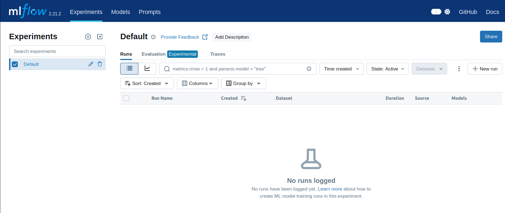

# remote_mlflow
Containerized setup of remote mlflow.
Medium article here: [Remote MLFlow setup with Docker](https://medium.com/@hitorunajp/remote-mlflow-setup-with-docker-de54652241a4)

## MinIO setup

Make sure that the necessary data folder exist
```bash
$mkdir -p ${HOME}/minio/data

$mkdir -p ${HOME}/mysql/mysql_data

$mkdir -p ${HOME}/mlruns


```
and then run it as

```bash
$docker compose up -d
```

then you can access the mlflow GUI clicking at http://localhost:5000/ 



For reference, minio is at  http://localhost:9001/
and the DB can be reached at http://localhost:8080/
